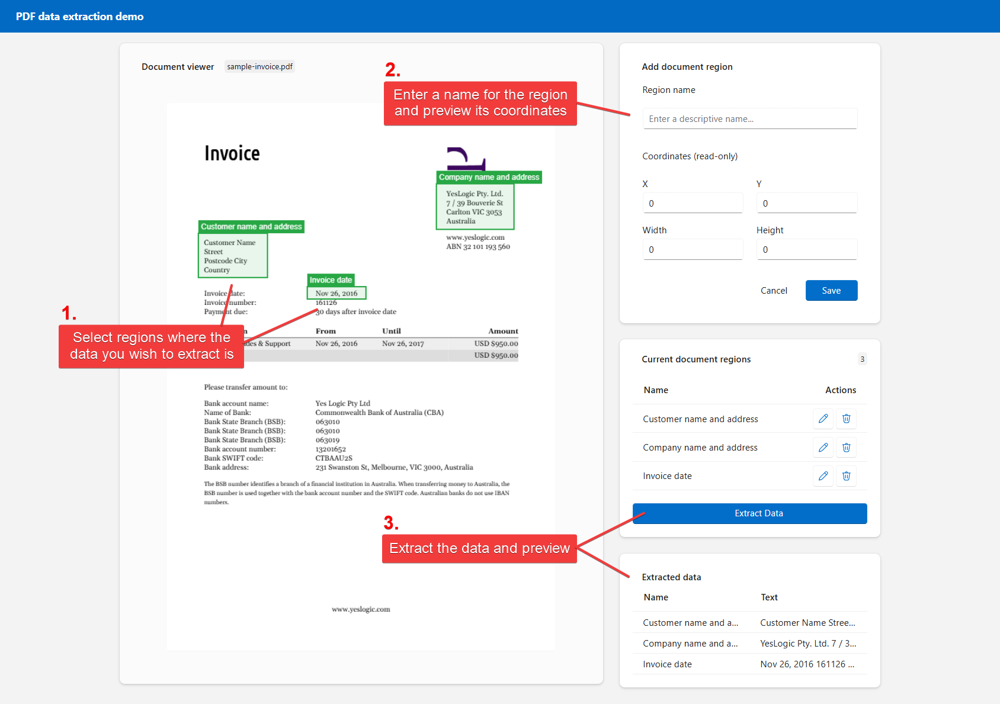

# PDF data extraction using `PdfPig`

This is a sample project exploring the capabilities of the `PdfPig` NuGet package for document data extraction. The project demonstrates how to extract text and data from PDF documents, all withing a Blazor WebAssembly standalone app that runs entirely from the browser.

## Web project

The web project is a Blazor WebAssembly standalone app that provides an interactive interface for PDF data extraction. Key features include:

- **`PdfPig` integration**: Uses the `PdfPig` NuGet package to extract text and data from PDF documents
- **Modern UI**: Built with Microsoft Fluent UI Blazor component library (I wanted to give it a try)
- **PDF data selection**: Uses the `pdf.js` JavaScript library to support highlighting regions of the PDF document for data extraction
- **Data extraction**: Extracts the selected data from the PDF and displays it in a structured format

> [!TIP]
> Run the app via `dotnet run` from the `/src` directory or open the solution in your preferred IDE.

## Test project

The test project is just a playground for experimenting with `PdfPig` features before incorporating them into the web application. It does not include tests for the web app itself. It experiments with various capabilities of the `PdfPig`, including:

- Basic PDF text extraction
- Block-based content extraction
- Region-specific data extraction
- PDF structure analysis
- Advanced text extraction techniques

> [!TIP]
> Run the tests via `dotnet test` from the `/tests` directory or open the solution in your preferred IDE.

## Future plans

See the [project backlog](https://github.com/users/ryanspain/projects/5/views/2) for a view into what I plan to work on next (if I find the time).
